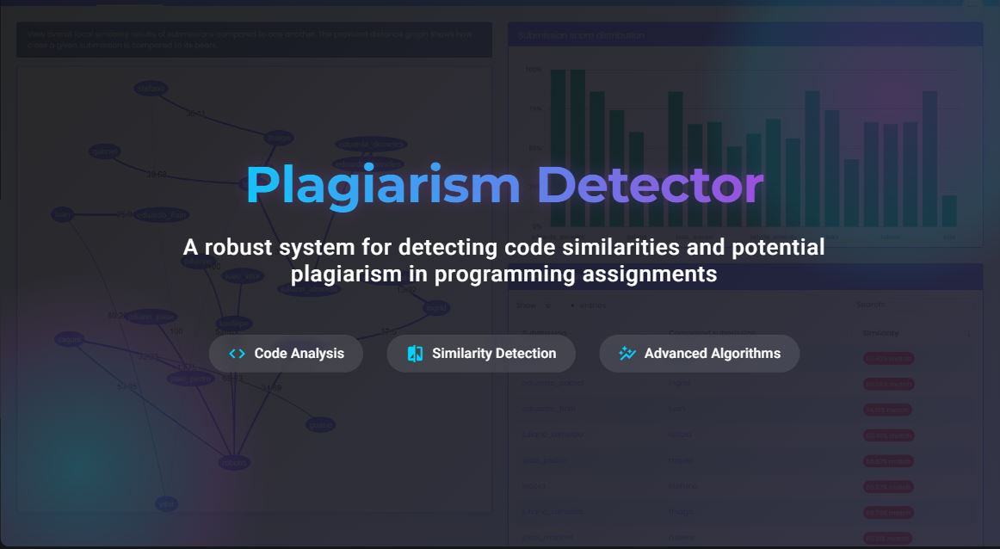

<p align="center">
  
</p>
# Plagiarism Detector

A robust system for detecting code similarities and potential plagiarism in programming assignments.

## Overview

This plagiarism detection system identifies similar code submissions using a multi-stage pipeline:

1. **Parsing & Tokenization**: Transforms code files into normalized token sequences, filtering common elements.
2. **Similarity Detection**: Uses the Rabin-Karp algorithm to find matching token sequences between submissions.
3. **Graph Construction**: Creates a weighted graph where nodes are submissions and edges represent similarity scores.
4. **Clustering**: Applies BFS/DFS algorithms to group similar submissions into clusters.
5. **Representative Selection**: Uses a greedy algorithm with merge sort to select representative submissions from each cluster.
6. **Metadata Management**: Stores and retrieves submission metadata efficiently using a B+ Tree structure.
7. **Real-time Updates**: Processes new submissions and updates clusters incrementally.

## Project Structure

```
PlagiarismDetector/
│
├── src/                  # Source code
│   ├── __init__.py       # Makes the directory a package
│   ├── bplus_tree.py     # B+ Tree implementation for metadata storage
│   ├── clustering.py     # BFS/DFS implementation for finding clusters
│   ├── greedy.py         # Greedy algorithms for representative selection
│   ├── main.py           # Main orchestration of the detection process
│   ├── parser.py         # Code parsing and tokenization
│   ├── rabin_karp.py     # Rabin-Karp string matching algorithm
│   └── similarity.py     # Similarity score calculation and graph building
│
├── tests/                # Test cases
│   ├── __init__.py       # Makes the directory a package
│   └── test_cases.py     # Test scripts
│
├── inputs/               # Directory for input files
│   ├── file_a.py to file_y.py  # Sample submissions
│   ├── file_1.py to file_50.py # Scalability test submissions
│   ├── file_z.py         # Real-time update test file
│   └── metadata.json     # Metadata for all submissions
│
└── outputs/              # Directory for output files
    ├── test_basic.txt    # Results of basic functionality test
    ├── test_constraint.txt  # Results of constraint & edge case test
    ├── test_integration.txt # Results of algorithm integration test
    ├── test_realtime.txt # Results of real-time update test
    └── results.txt       # Default output file
```

## Setup and Usage

### Prerequisites
- Python 3.7 or higher

### Running the Detector

1. **Basic usage**:
   ```
   python -m src.main inputs 0.7
   ```
   This runs the detector on all files in the `inputs` directory with a similarity threshold of 0.7.

2. **Run test cases**:
   ```
   python -m tests.test_cases
   ```
   This runs all test cases and generates output files in the `outputs` directory.

3. **Command-line arguments**:
   - First argument: Input directory (default: "inputs")
   - Second argument: Similarity threshold (default: 0.5)

### Output Format

The detector outputs a text file with the following sections:

1. **Cluster information**:
   - List of files in each cluster
   - Representative file(s) for each cluster
   - Similarity matrix showing similarity scores between files
   - Metadata for representative files

2. **Summary statistics**:
   - Total submissions processed
   - Number of clusters found
   - Number of suspicious clusters (>1 submission)
   - Number of isolated submissions
   - Largest cluster size
   - Parameters used (threshold, k-gram size, clustering method)
   - Execution time

## Test Cases

1. **Basic Functionality Test**: Tests core detection with simple files (A, B, C, D).
   - **Expected outcome**: Files A, B, C form a cluster with high similarity, D is separate.

2. **Constraint & Edge Case Test**: Tests handling of edge cases:
   - Files E, F, G: Tests handling of comments, whitespace, and reordered code.
   - File H: JavaScript file (.js extension) - should be processed but remain isolated.
   - File I: Empty file - should be processed but remain isolated.
   - 50+ files: Tests B+ Tree efficiency with a large number of submissions.
   - **Expected outcome**: E, F clustered; G may cluster with E/F; H, I are separate and well-handled.

3. **Algorithm Integration Test**: Tests complete system with larger dataset:
   - 75+ files including multiple similarity groups.
   - **Expected outcome**: J, K, L cluster; M, N cluster; W, X, Y cluster; most short files separate.

4. **Real-Time Update Test**: Tests incremental processing of new submissions.
   - **Expected outcome**: New file Z clusters with similar files A, B, C.

5. **Threshold Sensitivity Test**: Tests system with multiple similarity thresholds.
   - **Expected outcome**: Different thresholds produce different clustering results, showing sensitivity.

## Edge Case Handling

The system handles several important edge cases:

1. **Different File Types**: Processes both Python (.py) and JavaScript (.js) files, treating them as distinct.
2. **Empty Files**: Properly processes empty files, marking them with a special token.
3. **Short Files**: Uses token-based similarity for files too short for k-gram comparison.
4. **Code Comments**: Strips comments to focus on code structure and logic.
5. **Variable Renaming**: Normalizes identifiers to detect similarity despite variable name changes.
6. **Whitespace Changes**: Normalizes whitespace to detect similarity despite formatting changes.

## Algorithm Details

- **Rabin-Karp**: Uses rolling hash function to efficiently find matching token sequences.
- **Graph Algorithms**: BFS/DFS find connected components in the similarity graph.
- **Greedy Selection**: Chooses representatives based on highest average similarity within clusters.
- **B+ Tree**: Enables efficient storage and retrieval of metadata.
- **Merge Sort**: Used to rank submissions by similarity scores.

## Performance

The system efficiently processes 75+ submissions in seconds, with customizable similarity thresholds to balance precision and recall when detecting potential plagiarism.

## Advanced Features

1. **Multi-language Support**: Handles both Python and JavaScript files with language-specific tokenization.
2. **Adaptive Similarity**: Adjusts similarity calculation based on file type and content.
3. **Real-time Updates**: Processes new submissions incrementally without recomputing everything.
4. **Detailed Statistics**: Provides comprehensive analysis of clustering results.
5. **Threshold Testing**: Supports testing with multiple thresholds to find optimal settings.
